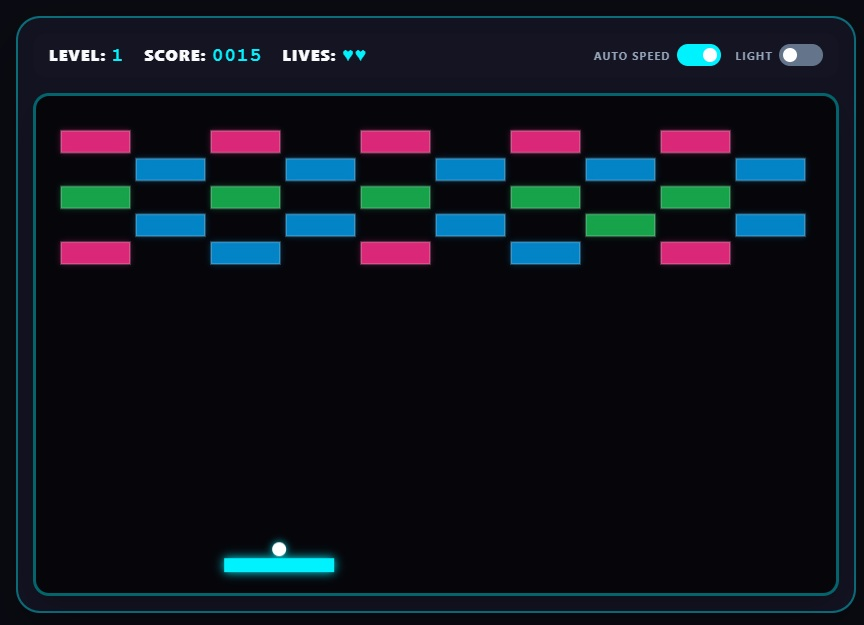

# DX-Ball

A vibrant, retro-inspired brick breaker game engineered directly for modern web browsers. Featuring high-energy neon visuals, dynamically scaling multi-hit brick configurations, active power-up capsules, laser defense capabilities, synthetic sound generation, and dual visual themes.

---


## Live Demo

Experience the game directly in your browser:

👉 **[Click Here to Play the Live Demo](https://abyshergill.github.io/dx-ball/)** 

---


## 🕹️ What is DX-Ball?

**DX-Ball** is a legendary PC brick-breaker game originally released in 1996 by Michael P. Welch. Heavily inspired by the classic arcade game *Arkanoid*, DX-Ball became an instant classic and a staple of late-90s shareware gaming due to its smooth gameplay, vibrant presentation, and iconic power-ups (like paddle extension, lasers, and multi-ball split).

*DX-Ball Level Edition* is a modern, web-native homage to that classic era, blending the beloved gameplay loop of the 1996 original with contemporary neon aesthetics, smooth canvas rendering, and responsive touch controls for modern devices.

---


## ✨ Features

* **Dynamic Level Packs:** Includes 3 pre-configured maps with increasing complexity inspired by classic layouts (Checkered Field, Space Invader, and Neon Castle).
* **Multi-Hit Brick Durability:** Bricks require up to 3 distinct impacts to shatter, shifting color profiles as their structural integrity depletes.
* **Active Modifiers (Power-Ups):**
* `E` **Expand Paddle:** Extends the paddle's structural width for enhanced screen coverage.
* `L` **Laser Cannons:** Mounts dual laser turrets to the paddle to aggressively destroy bricks from a distance.
* `P` **Extra Life:** Restores lost health pools to lengthen game sessions.


* **Dynamic Speed Adjustment:** Optional toggle system that gradually escalates velocity vectors over sustained brick chains.
* **Audio Synthesizer Engine:** Uses the native HTML5 Web Audio API to procedurally generate distinct sound frequencies on-the-fly without external asset dependencies.
* **Adaptive Theme Settings:** Clean light/dark modes that immediately re-map color tables for the workspace interface.

---

## 🛠️ Installation & Architecture

This application is built entirely as a self-contained single-page architecture (SPA) leveraging standard vanilla web APIs. No bundlers, external tracking engines, or secondary frameworks are required.

### Local Installation Steps

1. **Clone or Download the Repository:**
```bash
git clone https://github.com/abyshergill/dx-ball.git
cd dx-ball

```
2. **Launch the Application:**
Because it relies entirely on local runtime execution, you can directly interact with it using one of two methods:
* **Direct Open:** Double-click the `indexHere is the updated README file, revised to include an explanation of what *DX-Ball* is and its historic significance to the brick-breaker genre.

## 🎮 How to Play

### Launch Sequence

* Click the **PLAY GAME** button on the UI splash overlay.
* Tap the active rendering viewport canvas or hit the **Spacebar** key on a keyboard to release the ball from a resting state on the paddle platform.

### Control Configurations

The framework is optimized for both static desktop interfaces and dynamic, fluid touch tracking surfaces:

| Input Interface | Movement Mechanism | Special Action (Fire Lasers) |
| --- | --- | --- |
| **Keyboard Interaction** | A / D or ← / → Directional Arrows | Spacebar |
| **Mouse System** | Free cursor tracking across horizontal space | Left Mouse Click |
| **Touch Display** | Smooth continuous finger dragging on screen | Direct viewport tap event |

---

## 📄 License

Distributed under the terms of the **MIT License**.

```text
MIT License

Copyright (c) 2026 Kuldeep Singh aka Aby

Permission is hereby granted, free of charge, to any person obtaining a copy
of this software and associated documentation files (the "Software"), to deal
in the Software without restriction, including without limitation the rights
to use, copy, modify, merge, publish, distribute, sublicense, and/or sell
copies of the Software, and to permit persons to whom the Software is
furnished to do so, subject to the following conditions:

The above copyright notice and this permission notice shall be included in all
copies or substantial portions of the Software.

THE SOFTWARE IS PROVIDED "AS IS", WITHOUT WARRANTY OF ANY KIND, EXPRESS OR
IMPLIED, INCLUDING BUT NOT LIMITED TO THE WARRANTIES OF MERCHANTABILITY,
FITNESS FOR A PARTICULAR PURPOSE AND NONINFRINGEMENT. IN NO EVENT SHALL THE
AUTHORS OR COPYRIGHT HOLDERS BE LIABLE FOR ANY CLAIM, DAMAGES OR OTHER
LIABILITY, WHETHER IN AN ACTION OF CONTRACT, TORT OR OTHERWISE, ARISING FROM,
OUT OF OR IN CONNECTION WITH THE SOFTWARE OR THE USE OR OTHER DEALINGS IN THE
SOFTWARE.

```

